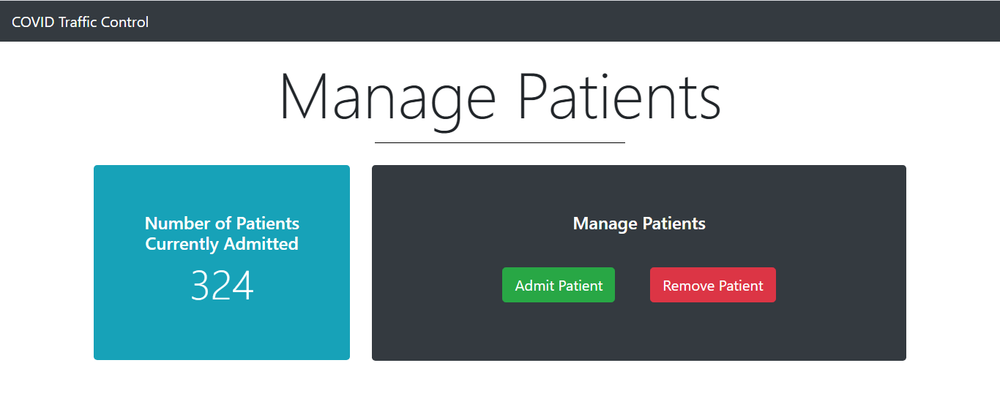
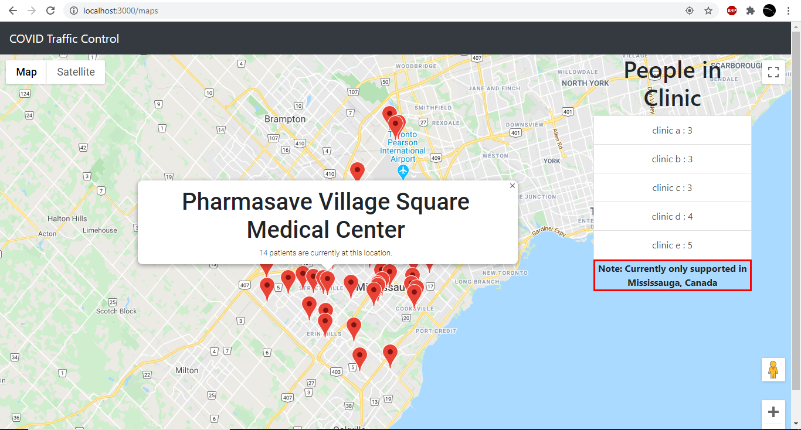

# COVID Traffic Control

React app created to help patients track patient density at local hospitals. Tools used include Firebase Realtime DB and Google Maps API. Learn more about COVID TC on [Devpost](https://devpost.com/software/def-hacks-mcxzhb).

